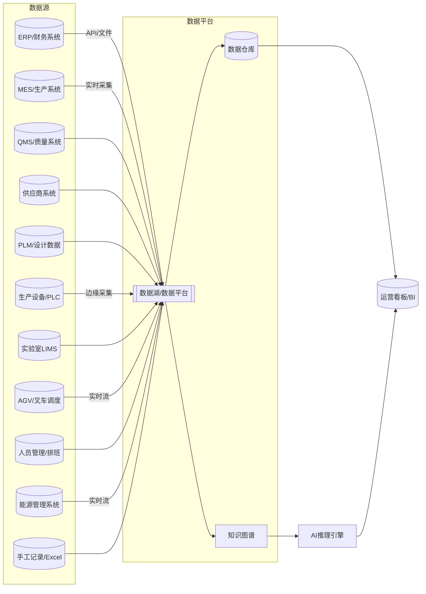
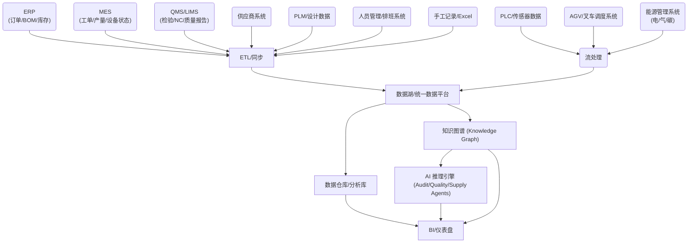
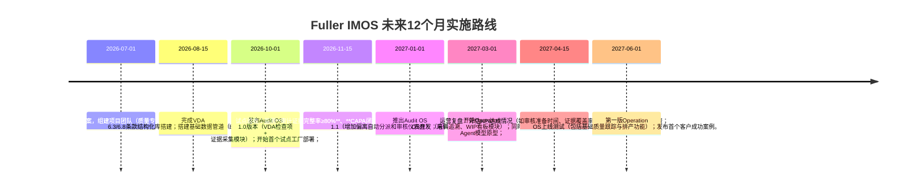

# 执行摘要

**市场前景**：随着中国汽车零部件企业出口欧美、OEM 审核要求升级（VDA 6.3/6.8、IATF16949、OEM CSR 等），过程可视化、证据链完整性与预测预警成为刚需【5†L40-L48】【22†L26-L28】。全球制造执行系统市场（2026年186.1亿美元，2034年566.5亿美元，CAGR≈14.9%【30†L671-L679】）和工业 AI 市场（2025年AI制造34亿美元至2030年155亿美元）均在高速增长。但主流MES/ERP 供应商主要卖 **效率优化**，缺乏面向**审核准入和供应链可视化**的解决方案。弗勒应抓住这一垂直细分痛点：**帮助汽车零件供应商“把VDA/OEM审核要点落到实处”**，为客户提供**审核常态化运营平台+智能优化工具**，而非简单替代传统ERP。

**产品定位与架构**：**Fuller Intelligent Manufacturing Operating System（Fuller IMOS）** — 构建 AI 驱动的制造业数字神经系统，从审核准入到工业智能体，重新定义制造企业的经营方式。分层推进战略——**Audit OS（审核准入系统）→ Operation OS（运营控制系统）→ AI Copilot（工业智能体）→ 行业工艺包**。第一阶段产品（Audit OS）聚焦VDA 6.3/6.8、Formal Q等条款数字化、证据链采集、CAPA 闭环和审核就绪度看板。第二阶段加入供应链追溯、WIP 管理、质量控制、动态排产等”运营控制”功能。第三阶段通过 **Audit Agent、Quality Agent、Supply Chain Agent、Planning Agent、CEO/COO Agent** 等AI 智能体，实现风险预测、决策建议、AI 排产等增值。每个智能体有清晰的输入/输出和指标，如质量智能体对比检验数据、预测缺陷率，计划智能体动态调度订单，CEO 智能体生成每日运营预警。

**核心差异化：四大”打破”，重新定义工业运营管理范式**。Fuller IMOS 并非传统 ERP/MES 的简单叠加，而是从底层逻辑上对工业管理范式的重构，体现在四个维度：

1. **打破管理时间颗粒度：从天到分钟（甚至秒）**。传统ERP以”天”为最小管理周期（日结、日盘点、日报表），决策者在事后才知道发生了什么。Fuller IMOS 将管理颗粒度压缩到分钟甚至秒级——设备节拍、产线节拍、质量波动、物流状态实时可感，管理者不再等”昨天发生了什么”，而是看清”此刻正在发生什么”。

2. **打破静态管理到动态管理**。传统ERP以”计划-执行-比对”的静态闭环运作：月初排计划、月末看差异、下月再调整。Fuller IMOS 实现**持续动态管理**——订单变化、设备异常、质量波动、供应商延迟等信息被实时捕捉，系统即时重算影响面并生成调整建议，管理动作从”被动事后补救”转向”主动事中干预”。

3. **打破”账本反向定义运营”到”AI 正向计算可能性”**。传统ERP从财务账本出发，反向倒推运营指标（库存金额、成本差异、效率偏差），本质是”用财务结果定义运营水平”。Fuller IMOS 在分钟/秒级数据颗粒上，由 AI 正向计算产线、设备、人员、物料的实时状态，基于当前数据**预测”未来一段时间的可能性”**——例如”未来2小时该产线有87%概率出现缺料停线”——并随即自动做出调整决策建议（如调整排产顺序、触发紧急补料流程），而非等到月底看报表才发现问题。

4. **打破管理内容边界：将物理世界完整纳入管理范畴**。传统ERP的管理对象局限在”账本可见”的范围（订单、库存、应收应付），大量物理世界的运营要素被排除在外。Fuller IMOS 将 **AGV/叉车运行轨迹与利用率、人员工时与技能匹配、能源消耗曲线与碳排放** 等物理要素一并纳入管理平台，实现”物理世界”与”财务世界”的完全映射与可比对——例如某产线单位能耗与产出价值的实时对比、AGV 调度效率对交付周期的影响量化、人员排班对单位工时产出的直接关联分析，从而做到**运营决策在财务数据上完全可验证、可追溯**。

**数据底座**：整合ERP（订单、BOM、库存、财务）、MES（工单、生产进度）、QMS（检验记录、NC、CAPA）、PLM/设计数据、供应商系统、设备PLC/传感器等多源数据。通过 **ETL/流处理+知识图谱/RAG** 将数据结构化：用知识图谱关联物料、设备、流程、供应商、质量事件等实体；用RAG技术让Audit Agent等在VDA条款库和企业文档间检索匹配。示意架构如下：

**商业模式**：采用**“项目导入+订阅+模块化+绩效分成”**组合模式。首年项目费可定价150–300万元（含审核咨询+系统部署），续费/订阅50–150万元/年，AI智能体模块（如质量预测、排产优化）可额外收费50–150万元/年，绩效分成约10%–20%。例如，某客户通过系统避免1000万库存/返工，对应绩效费100–200万元。不同客户分层定价：重点出口企业可上限定价300万级，普通内销企业仅30–80万。收入组成目标（成熟期）：**咨询实施20%**、**订阅软件与AI模块占比50%**、**绩效分成10%**、**工艺包复用收入20%**。   

**交付与风险**：项目交付偏重咨询与本地化服务，典型周期3–9个月；初期需精干交付团队（质量/运营专家+系统工程师）。要制定标准化SOP：**诊断评估→关键流程数字化→系统配置→用户培训→上线验收**，并形成可复制的工艺包模板。量化客户价值指标，如“审核准备周期从6个月缩短到2个月”、“审核证据完整率提升至95%以上”、“CAPA闭环时间缩短50%”、“库存周转率提升20%”、“准时交付率达98%以上”【22†L76-L84】【22†L128-L130】。主要风险包括技术集成难度、数据质量不足、客户采用阻力、AI责任归属、收入确认等。通过**引入人工审核闭环、防错机制和明晰合同条款**可缓解风险；AI方面要遵循ISO/IEC 42001等规范、保证可解释性和可审计性【27†L49-L57】【25†L239-L247】。

**上市前景**：如果能将收入结构从咨询转向订阅软件+AI模式，毛利率提升至60%以上，客户规模300+，并形成行业IP和标准化产品，未来具备上市条件。必须达成：软件/AI收入占比>50%，前三年收入达到数亿人民币（对标科创板、中证500市值），建立健全治理体系并形成独立案例和技术壁垒。总体而言，选择**垂直深耕、数据+AI驱动路径**的项目更可能成功。

--- 

## 一、行业背景与机会

- **客户痛点：供应链透明和质量保证。** 当前汽车行业向电动化、智能化发展，产品迭代周期缩短，零缺陷容忍度极低，OEM 厂商对供应链透明度和可追溯性要求不断提高【22†L26-L28】。主机厂审核强调全过程控制：VDA 6.3 关注过程审核，VDA 6.8 则覆盖物流与供应链过程，包括信息安全等新领域【5†L36-L44】【5†L49-L58】。例如，当某批转向节出现质量问题时，MES 系统应能实现“正向追溯”热处理曲线、“反向追溯”钢材批次流向，并通过 AI 定位问题根因【22†L76-L84】。传统企业多靠人工收集资料、Excel 管理，在面临“主机厂问你产品测试记录”时常需要翻箱倒柜，效率低且风险大【11†L93-L100】。  

- **行业市场规模**：全球制造执行系统市场持续增长。据报告，2026年全球MES市场规模约186亿美元，2034年将达566亿美元，年均复合增长率近15%【30†L671-L679】。亚太地区在2025年占全球约30%份额，可见中国市场潜力巨大（多项市场调研）。与此同时，AI驱动的智能制造也成为趋势，预计未来十年相关市场将呈爆发式增长。然而，行业痛点更迫切的是**合规与刚需**：汽车零部件企业急需一种**将VDA审核要求融入日常运营的系统**，而非简单的效率工具【22†L84-L92】【5†L49-L58】。

- **传统ERP的四大结构性缺陷**：深入分析现有ERP/MES体系，可以发现其根本性局限并非”功能不够多”，而是**管理范式的结构性缺陷**。其一，**时间颗粒度粗放**——传统ERP以”天”为最小管理单元，日结账、日盘点、日报表是其基本运作逻辑，这意味着从问题发生到管理者感知至少滞后24小时，而现代产线的节拍以秒计、异常以分钟为单位扩散。其二，**管理逻辑静态**——ERP基于”月初计划→月末比对→下月调整”的静态循环，本质上是对已发生的偏差做事后修正，无法在偏差出现的第一时间动态响应。其三，**运营水平由账本反向定义**——ERP从财务结果倒推运营效率（如用月末库存金额反推库存管理水平），而非从实时运营数据正向推演未来趋势，这种”后视镜式管理”导致决策始终滞后于现场实际。其四，**管理边界局限于财务可视范围**——ERP只能管理”入账”的对象（订单、库存、应收应付），大量物理世界的关键运营要素（产线设备实时状态、AGV/叉车运行效率、人员工时利用率、能源消耗曲线）被排除在管理视野之外，导致运营决策与财务结果之间存在巨大的”数据断层”。这四大缺陷在汽车零部件出口企业面临的VDA审核场景中尤其致命——审核官要求的是**过程证据的实时性与完整性**，而非事后补录的报表。

- **竞争格局**：目前市场上已有多种ERP/MES/QMS产品。龙头厂商（SAP、Oracle、西门子、Rockwell、ABB等）主打全面解决方案，竞争激烈；本地软件（用友、金蝶、鼎捷、朗速、亿维等）则提供中小企业数字化解决方案。如朗速科技聚焦汽车零件MES，以全流程可追溯为核心，通过边缘计算实现毫秒级数据响应【15†L438-L442】。但这些系统往往功能宽泛，缺乏针对**VDA审核和自动证据链**的专用功能，且均未从根本上突破上述四大结构性缺陷。行业分析指出：”汽车零部件企业更关注全流程追溯模块，确保满足合规要求”【15†L438-L442】。Fuller IMOS的差异化在于**”以审核准入为切入点，将质量、供应链、生产与AI合并成闭环运营体系，同时从底层架构上突破传统ERP的时间颗粒度、管理逻辑、计算范式与管理边界四大限制”**，形成独特护城河。

## 二、目标用户画像与首批ICP

**理想客户画像（ICP）**：年营收**1亿–20亿**人民币，生产汽车传动轴、万向节、轴承等零部件，已有**IATF16949体系但VDA 6.3/6.8能力薄弱**，正在或计划进入大众、奔驰、宝马、沃尔沃等**欧美OEM供应链**。这些企业对*通过审核拿订单*极度渴求，但现有ERP/MES体系无法自动支撑审核证据链。首批“种子客户”典型特征包括：  
- **出口压力大**：已有欧美或全球Tier1客户订单，但体系能力不足，审核屡遭补充材料、整改；  
- **审核失败成本高**：一次审核失败可能丢失数千万订单，客户经理承压；  
- **质量和交付压力**：对不良率、延期交付罚款敏感；  
- **数字化基础中等**：通常已有ERP系统（如SAP、用友）和基础MES，但系统割裂，更多依赖人工Excel。  
这种客户对“**通过VDA/OEM审核保证订单准入**”的价值认可度远高于“降本增效”之类的效率提升概念。其次阶段客户可扩展到：已有VDA审核经验、准备出海的中大型零部件厂；或体系稍弱、愿意迭代升级的客户。明确**迭代顺序：先锁定强痛点客户，再慢慢辐射普通制造业**。

## 三、产品架构与AI 智能体能力

### 1. 产品分层架构

- **Audit OS（审核准入系统）**：核心入口产品。功能包括：VDA 6.3/6.8、Formal Q等条款结构化（鸭龟图+流程图）；**证据链自动归集**（生产数据、质检记录、来料检验、物流信息等与审核条款关联）；**偏离项/CAPA闭环**（自动生成整改任务并追踪完成）；**审核就绪看板**（实时展示证据缺失项、风险点、整改进度）；**自动报告输出**（按不同OEM模板生成审核包）。MVP范围：支撑1-2关键工艺或车间的审核准备；DevOps模式+现场咨询结合交付。  
- **Operation OS（运营控制系统）**：在Audit OS基础上延伸供应链和生产过程控制功能，实现**从”天级静态管理”到”分钟级动态管理”的跨越**。加入物料追溯（批次、供应商、历史不良）、WIP在制品可视化、仓储物流管理、供应链风险预警（缺料、延期）、质量异常监控（SPC/缺陷趋势）、订单交付可视化等。**核心突破在于管理对象边界的扩展**——将 **AGV/叉车运行轨迹与利用率、人员工时与技能匹配、能源消耗曲线与碳排放** 等物理世界要素纳入统一管理平台，实现生产、仓储、物流一体化调度（可参考朗速”生产-仓储-物流”管控一体化【15†L438-L442】），使每一项物理运营决策（如AGV路径优化、人员排班调整）都能与财务结果直接对标。MVP：锁定1-2条产线的物料流和质量流程。  
- **AI Copilot（工业智能体）**：基于前两层的实时数据和历史数据，提供预测、推荐和自动决策支持。这是实现**”AI正向计算未来可能性”**的核心层——不同于传统ERP从账本反向定义运营水平，AI Copilot 在分钟甚至秒级数据粒度上进行正向计算，基于当前实时状态推演未来一段时间的各种可能性，并即时生成调整决策建议。包括：**审计智能体**（Audit Agent）、**质量智能体**、**供应链智能体**、**排产/调度智能体**、**经营助手（CEO/COO）智能体**等。每个智能体背后使用机器学习/知识图谱/RAG等技术，将业务规则与数据驱动结合。它们不仅”做问题提醒”，更生成**可执行的管理动作建议**，且每个决策均可在财务维度上追溯验证——例如排产智能体建议的产线切换方案，系统同步计算出该方案对单位能耗成本、人均产出、交付准时率的影响【22†L78-L84】【27†L49-L57】。

### 2. AI 智能体能力清单

我们设计的核心AI 智能体及其能力包括（详见下表）：

- **Audit Agent（审核智能体）**：自动解析VDA 6.3/6.8、OEM CSR文档，将条款拆解为检查要点；检索企业历史数据、过程文档和质量记录，**匹配并验证证据**是否满足条款；自动标记疑似不符合项并生成提问；输出“证据缺失+风险清单”及整改建议。  
- **Quality Agent（质量智能体）**：实时分析检验数据、过程参数、产线SPC，检测质量漂移或异常趋势；关联设备、刀具、供应商和操作员信息，识别质量问题根因；在发现偏离时自动生成检验计划调整或返修建议。  
- **Supply Chain Agent（供应链智能体）**：预测供应商交付延迟风险和质量风险（基于交付历史、供应商绩效），预警潜在缺料或物流问题；监控库存水平、WIP与前置时间，动态调整安全库存；自动推荐替代供应商或加急策略。  
- **Planning Agent（计划智能体）**：对工厂订单和产能进行模拟排产。输入订单需求、设备工位信息、物料可用性，输出动态排产计划。**核心突破在于"正向计算未来可能性"**：当紧急订单插入或资源约束变化时，AI 在分钟级内模拟多种排产方案，预测每种方案的交付准时率、产能利用率、单位能耗成本和人员负荷，并自动推荐最优方案——而非等到事后发现延期再补救。例如："若将订单A切换至2号线，预计交付准时率从72%提升至94%，单件能耗降低8%，但需要临时调度2台AGV至该区域"。  
- **CEO/COO Agent（经营决策智能体）**：汇总各部门数据，生成高层每日/每周运营报告。主动指出”当前最大风险点”（如哪条线会延误、哪个供应商需关注、哪个批次不良率异常等）；给出直观决策建议（如”建议今明两天对3号线进行质量巡检，防止停线”）。**管理边界扩展后的独特价值**：CEO Agent 能够将 AGV 利用率、人员效率、能源成本等物理运营数据与财务数据统一呈现——例如”今日3号线单位产出能耗较昨日上升12%，主要原因为AGV充电窗口集中导致2台AGV离线，建议错峰充电以恢复能效水平，预估月度可节省电费约3.2万元”。重点帮助管理层由经验驱动转为数据驱动，使每一项运营调整的财务影响实时可算、可追溯。

#### 智能体KPI与落地难度

| 智能体       | 关键KPI（示例）                   | 实现难度（5分） | 说明                                    |
|--------------|----------------------------------|----------------|-----------------------------------------|
| 审计智能体   | 审核条款覆盖率95%、证据自动匹配准确率90% | ★★★☆☆ (3)      | 文件检索+知识图谱方法，需构建VDA条款库。       |
| 质量智能体   | 质量异常预测准确率>85%、缺陷率下降10%    | ★★★★☆ (4)      | 需收集高质量传感/检测数据，进行时序分析。    |
| 供应链智能体 | 交付延期预警准确率>80%、库存周转率提升10% | ★★★★☆ (4)      | 涉及外部供应链数据，复杂度高。              |
| 排产智能体   | 产线准时完成率>95%、交付延误风险<5%      | ★★★★★ (5)      | 排产问题NP-hard，对数据准确度要求极高。      |
| 经营助手智能体 | 准时交付率>98%、库存降低20%            | ★★★☆☆ (3)      | 综合利用其他智能体结果，主要逻辑与报告生成。 |

各智能体所需**数据**包括：Audit Agent需VDA条款库、产品工艺文件、流程图、检验报告等；Quality Agent需尺寸测量、运行参数、检验记录；Supply Chain Agent需供应商交期、物流状态、ERP库存信息；Planning Agent需订单、产能及物料状态；CEO Agent需汇总运营指标（OEE、产量、库存、财务等）。**模型类型**可选用：知识图谱+规则引擎（Audit Agent）、时序预测（Quality/Supply）、优化算法（Planning）、决策树/规则系统（CEO Agent）。**可解释性**要求高：应生成审计日志、置信度分数和规则依据【27†L49-L57】【25†L239-L247】。例如，对“判定该流程不符合VDA某条款”的结果，要提供匹配的证据和规则；对异常预测，输出模型依据（如哪个变量偏离阈值）。

## 四、数据底座设计

为支持上述功能，必须搭建**融合多源的工业数据底座**：  
- **数据域与源**：ERP（订单、BOM、库存、成本、财务）、PLM/MDM（产品设计与BOM）、MES（工单、设备运行、生产记录）、QMS/LIMS（检验结果、不良记录、测量系统分析）、APS/WMS（排产、仓储）、供应商系统（PO执行、质量反馈）、物联网/PLC（设备参数、节拍、能耗）、**AGV/叉车调度系统（运行轨迹、利用率、充电状态）**、**人员管理/排班系统（工时、技能矩阵、产出效率）**、**能源管理系统（电力/燃气/水耗曲线、碳排放数据、单位能耗成本）**、手工记录（Excel文档、图纸、流程卡）、外部数据（原材料批号信息、天气等）。**管理边界扩展的关键意义**：纳入AGV/叉车、人员工时、能源等物理世界要素后，系统能够回答传统ERP无法回答的问题——"某产线今日单件能耗异常上升是否与AGV调度拥堵导致设备空转有关？""夜班人员技能匹配度不足是否直接导致了该时段不良率偏高？"——从而真正打通物理运营与财务结果的最后一公里。  
- **数据质量要求**：所有关键数据须具备**时间戳、一致的标识符**（如产品/批次编号）、完整性和准确性。错误/缺失数据需定期清洗和标注。对集成数据采用**数据治理**规范（主数据管理、元数据标识）来保障一致性。  
- **ETL与流处理**：采用混合架构：对于设备数据和实时采集场景，使用边缘计算+流处理（如Kafka、Flink）实现毫秒级数据流入；对于批量业务数据（ERP、MES），通过API定期同步至数据平台。所有数据汇聚到统一**数据湖**（Data Lake + Data Warehouse + Knowledge Graph）。  
- **知识图谱与RAG设计**：建立**实体关系图谱**，节点包括“零件/批次”、“生产工序”、“设备”、“供应商”、“审核条款”等，边表示“属于/使用/检测/供给”等关系。Audit Agent 可以通过**RAG（检索增强生成）**技术，将企业数据与VDA条款匹配：比如用知识检索找到“该批次生产记录对应VDA条款X的相关原始记录”，由自然语言处理评估是否满足条款。知识图谱有助于多源关联查询（如追溯一个不良品的所有相关实体链）。  

## 五、产品分层与交付模式

### 产品分层

| 产品层级       | 核心功能                                    | MVP范围                                     | 交付模式                    | 典型实施周期&团队      |
|----------------|---------------------------------------------|---------------------------------------------|-----------------------------|------------------------|
| **Audit OS**   | VDA 6.3/6.8 条款库、证据链采集、CAPA闭环、审核看板、报告生成 | 支持核心工序（如机加工/热处理）审核准备       | 诊断咨询 + 本地部署软件 + 培训 | 3–6 个月；交付团队：1-2名质量顾问 + 1名系统工程师 |
| **Operation OS** | 质量追溯、物料追踪、WIP可视、供应链监控、排产协同  | 扩展至关键供应链和生产流程，例如来料追溯和简单排产 | 继续咨询支持 + 软件配置     | 6–12 个月；需增加供应链专家、MES工程师       |
| **AI Copilot** | AI 审核助手、质量预测、交付/库存预警、动态排产建议、CEO仪表盘 | 初版AI模块上线（如AI质量/供应链预警）           | SaaS订阅模式 + 性能分成     | 12个月以上；新增AI工程师+数据科学家         |
| **工艺包模块** | 行业标准工艺流（铸造/锻造/装配等）快速部署模板     | 首批2-3种核心工艺包（如机加工+表面处理）        | 成熟后模块化交付            | 持续迭代；需要工艺专家与软件工程师配合开发   |

### 三阶段目标对比

| 阶段     | 时间范围   | 产品与交付                     | 客户/市场            | 核心目标                          |
|----------|------------|--------------------------------|----------------------|-----------------------------------|
| **0–18月**  | 1–1.5年  | 发布 **Audit OS V1** MVP 内测、首家种子客户项目实践 | 3–5家种子客户 质量部门、采购部门驱动 | 验证产品价值和商业模式；积累**VDA条款与工艺知识库** 实现**第一个软收入**（500–1500万） |
| **18–36月** | 1.5–3年  | 推出 **Operation OS** （质量+物流模块） 迭代Audit OS 推出首批AI模块（质量/供应链预警） | 客户30–80家 扩展到有体系但需优化的零件厂 | 标准化产品，推广**工艺包模块**；软件/订阅收入占比提升至40%+ 年收入达到0.5–1.5亿 |
| **36–72月** | 3–6年    | 完善**AI Copilot**平台 多种工艺包上线 云端SaaS + 模块化产品化 | 客户300家+ 大型Tier1和中型出口商 | 建立行业壁垒和数据壁垒：毛利率60%+、续费率85%+ 年收入3亿+，达到上市前规模 |

*注：客户和收入数据为示例性目标，实际视市场反应调整。*

## 六、商业模式与收入预测

- **定价模型**：首年项目费（咨询+系统实施）建议定为150–300万元/客户，续费（维护+云服务+周期性合规更新）50–120万元/年，AI 智能体和运营模块按年度订阅计费（如AI质量预测50–150万元/年、动态排产80–300万元/年），按照项目价值收取（即按客单价值定价）。可设置**混合支付**：合同签订50%预付，项目中期验收30%，上线验收20%。  
- **绩效分成**：在信任成熟后，可与客户签订绩效合约，如按“系统节省的成本/回款总额”的10-20%提成。例：客户因系统优化降低库存并释放2000万资金，绩效费按10%计200万。  
- **收入构成目标**（成熟后）：实施咨询占30%，软件订阅+云服务占30%，AI 模块占20%，工艺包占10%，绩效分成10%。  

- **三种情景预测（3年）**：

| **场景** | **假设**                                                                                                                           | **年收入预测（RMB）**                                |
|-----------|-------------------------------------------------------------------------------------------------------------------------------------|-------------------------------------------------------|
| 保守      | 1年5家客户、平均项目额150万 2年15家(前5续费、10新)、订阅费30万/年 3年30家(续费80%、新增20)、订阅费50万/年            | 1年：7.5M 2年： 30M 3年：80M                    |
| 基线      | 1年8家、项目200万 2年20家(续费75%、新12)、订阅70万/年 3年50家(续费80%、新30)、订阅100万/年+部分AI模块               | 1年：16M 2年：60M 3年：200M                     |
| 乐观      | 1年10家、项目250万 2年30家(续费80%、新18)、订阅100万/年 3年80家(续费85%、新50)、订阅150万/年+AI模块占比高            | 1年：25M 2年：125M 3年：400M                    |

**关键假设**：客户续费率70%-85%；客单价随痛点强度提高；毛利率初期40%-50%，逐年提升（咨询降、软件上升）。以上预测仅供参考，实际需根据销售进度和投入调整。

## 七、交付与标准化

- **交付SOP**：制定标准化交付流程，从项目启动前的**需求诊断**（梳理客户体系现状、痛点）开始，到项目结束的**验收交付**。核心步骤：  
  1. **诊断评估**：全面盘点客户工厂流程与现有系统，确定GAP。  
  2. **方案设计**：确定Audit OS功能范围与工艺包选择，签订合同。  
  3. **数据准备**：协助客户梳理、清洗和迁移关键数据（生产、质量、物流等）。  
  4. **系统配置与开发**：部署Audit OS核心功能；并行部署若干运营模块。  
  5. **试点实施**：在一个产线或工艺试点运行，收集反馈并优化。  
  6. **全厂推广**：推广至更多车间，培训用户和客户管理员。  
  7. **上线验收**：按照KPI和验收标准（如“证据完整率≥90%”）评估系统效果，正式交付。  
  8. **客户成功**：建立售后培训和知识库，定期回访跟踪效果。

- **工艺包标准化**：每推出一个工艺包（如“热处理追溯包”），需完成：  
  - 工艺流程分析和关键参数定义；  
  - 数据模型与规则配置（如热处理炉温曲线阈值）；  
  - 系统模板与标准报告（包含过程控制点、常见不良类型、纠正措施流程）。  
  形成文档和代码标准，并在内部验证后向其他客户快速复制。

- **客户成功与培训**：建立分级培训体系（管理员培训、操作员培训、管理层汇报培训），提供视频和文档；设立客户成功经理负责客户需求对接和定期复盘。每个项目明确价值指标，与客户签订**目标协议**（例如“四个月内质量不良率降低10%”等），以保证交付落地。

- **可量化价值指标示例**：

| 指标        | 基线（客户现状）      | 目标（部署后）      | 参考来源/说明                |
|-------------|-----------------------|--------------------|------------------------------|
| 审核准备周期   | ~6个月（人工准备资料） | ≤2个月              | 参考行业经验                 |
| 证据链完整率   | ~50%（手动不足）     | ≥95%               | 引入数字化LIMS提升80%效率【11†L108-L112】 |
| CAPA闭环时间  | ~60天               | ≤30天              | 自动提醒与闭环管理           |
| 管理响应延迟   | ~24小时（天级报表）  | ≤5分钟（实时感知）   | 管理时间颗粒度从天到分钟的跨越 |
| 库存周转率    | 3次/年               | ≥4次/年            | MES协同WMS整合后提升20%      |
| 准时交付率    | 85%                 | ≥98%               | HF MES案例98.5%目标【22†L128-L130】 |
| AGV/叉车利用率 | ~40%（无系统调度）   | ≥70%               | 统一调度平台优化后           |
| 单位产出能耗   | 基准值              | 降低8%–15%          | 能源纳入管理后实时优化       |
| 人员工时产出   | 基准值              | 提升10%–20%         | 技能匹配与动态排班优化       |

以上目标需根据具体场景调整，但均为可量化的业务KPI，便于评估系统价值。

## 八、风险与合规

- **技术风险**：系统集成难度大（不同ERP/MES接口、设备种类繁多）。*缓解*：采用标准协议（OPC UA/Modbus）、微服务架构，优选硬件兼容性好的设备；前期小规模验证后逐步扩展。  
- **数据风险**：数据质量参差（录入不全、时序错乱）。*缓解*：建立数据校验/补录流程，在实施前后进行数据清洗；关注“数据孤岛”问题【11†L93-L100】，确保关键数据均被纳入平台。  
- **客户采纳风险**：员工抗拒变革、交付周期长。*缓解*：重点说服高管支持，将项目定位为“保证客户准入/订单”的战略项目；分阶段交付，快速产出小胜利；强化培训与沟通，建立使用奖励机制。  
- **AI合规与责任**：AI决策需可审计、可解释【27†L49-L57】【27†L84-L91】。*缓解*：在系统中内置日志记录和置信度输出，每个AI建议都附带数据依据（如决策树路径或类似案例）；严格执行“人机协同”原则，所有AI自动建议由人工复核后执行。必要时采用可解释AI模型，避免完全黑箱。遵循ISO/IEC 42001等规范，对AI生命周期进行管理。  
- **法律合规**：若处理跨国数据，需考虑GDPR/中国个人信息保护等法规。*缓解*：仅采集业务数据（批次、工艺），不涉及个人敏感信息；在国外部署数据时使用当地云服务或VPN隔离；签订数据使用协议。  
- **收入确认风险**：工业软件项目容易出现大额预收款，需按软件交付规则确认收益。*缓解*：合同拆分为明确里程碑，分段验收确认收入；以订阅/许可费形式实现持续收入，降低单项目金额占比。  

## 九、上市准备要点

若将Fuller IMOS 推向资本市场，需迈过以下五大里程碑：

1. **收入结构优化**：软件订阅+服务占比≥50%，避免以一次性咨询为主；维持高续费率（≥85%），净收入留存率（NRR）110%以上。  
2. **毛利率提升**：持续提高至60%以上（最终目标≥70%），通过标准化产品、自动化工具减少人工作业占比。  
3. **客户规模扩大**：累计客户数应达300+，并实现细分市场覆盖。前五大客户收入占比控制在50%以内，避免过度集中。  
4. **技术/IP壁垒**：形成专利、软件著作权和独有算法；建设完整的行业知识库和模型库（VDA条款库、工艺参数库、缺陷案例库等）。  
5. **企业治理与合规**：建立上市公司管理架构，完善财务和内控，按IFRS/GAAP合规确认收入。员工持股/激励和独立董事制度准备到位。  

### 时间表与量化目标（示例）

| 里程碑             | 指标/要求                           | 目标时间（预测）    |
|--------------------|------------------------------------|---------------------|
| 收入达到 1 亿元/年 | 软件+订阅收入占比 ≥ 40%            | 3年内 (2029年)      |
| 毛利率 ≥ 60%       | 服务外包比率下降，SaaS比率上升        | 4年内 (2030年)      |
| 客户 ≥ 300 家      | 续费率 ≥ 85%，年新增客户 ≥ 50 家      | 5年内 (2031年)      |
| 拥有专利/著作权 ≥3  | 关键AI模型或算法获得知识产权          | 4年内 (2030年)      |
| 内控与合规就绪      | 完成IPO辅导备案，符合监管要求         | 5年内 (2031年)      |

达成以上目标后，公司基本具备主板或科创板上市潜力。上市可采取欧美OEM合作或AI智能制造方向叙事：如“Fuller IMOS是首个针对汽车零件行业的AI驱动**供应链可视化+审核运营**平台，已帮助多家出海车企通过VDA审核并实现交付优化”。

## 十、实施路线图（12个月）

### 12个月行动清单（示例，按月分解）

- **2026年7月**：确认需求与技术架构；梳理VDA条款和审核流程；团队招聘到位。  
- **2026年8月**：搭建数据中台环境（云/本地）；与ERP/MES建立数据接口；完成第一批模板（质检表单、作业指导）。  
- **2026年9月**：实现VDA检查项映射；开发证据链采集模块，关联关键数据字段；内部测试数据流通。  
- **2026年10月**：进入客户试点，部署Audit OS，开始收集反馈；同步进行AI模型训练（如质量异常检测）。  
- **2026年11月**：完成试点验收，修正缺陷；整理工程文档和操作手册；启动市场营销（案例宣传）。  
- **2026年12月**：总结阶段性成果，完善实施SOP；筹备首轮融资或资源投入。  
- **2027年1-3月**：开发运营控制模块（供应链监控、交付仪表盘等）；发布新版Audit OS；扩大客户部署（3-5家）。  
- **2027年4-6月**：推出第一个AI增强功能（AI质量预警）；完成年中业务评审；规划下一财年目标与预算。  

以上路线图和里程碑需根据市场反馈灵活调整，但关键是**快速交付可见价值、尽早建立客户信任**。  

  

**主要参考资料：** VDA / IATF 官方发布（VDA 6.3/6.8、AI质量管理）【5†L40-L48】【27†L49-L57】；行业MES与质量管理案例【22†L26-L28】【11†L93-L100】；行业研究报告（MES市场规模、AI制造趋势）【30†L671-L679】【22†L84-L92】等。以上规划结合弗勒内部制造与质量经验编制，并使用了行业公开资料以确保判断的可靠性。