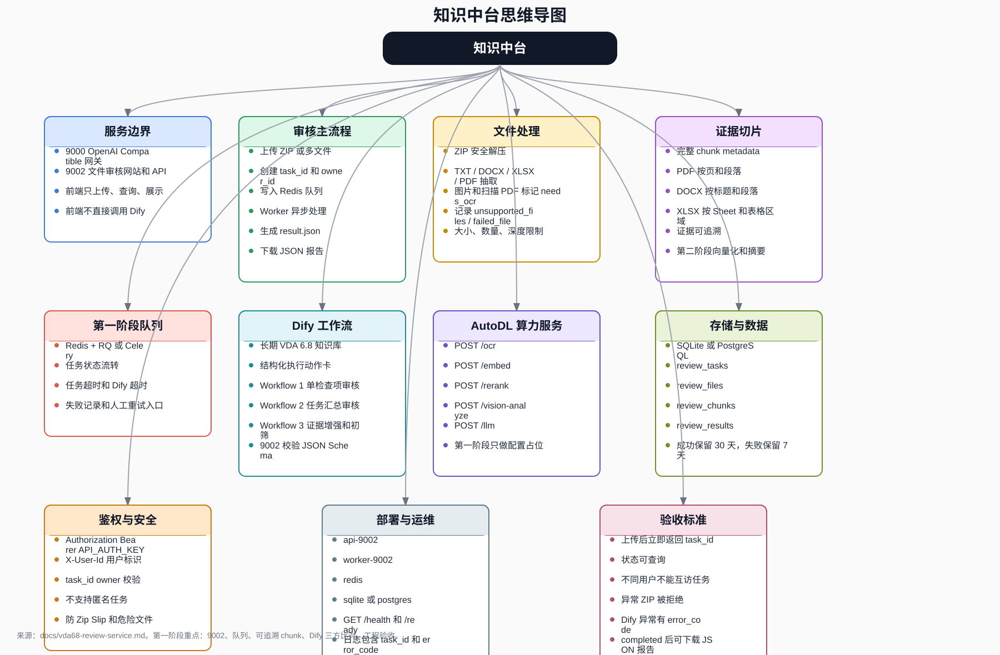

# VDA 6.8 文件审核服务规划



阶段计划：

- 第一阶段实施计划：[docs/plan/9002-phase1-plan.md](./plan/9002-phase1-plan.md)
- 第二阶段实施计划：[docs/plan/9002-phase2-plan.md](./plan/9002-phase2-plan.md)

## 1. 业务定位

当前项目需要拆成两层能力：

```text
9000: OpenAI Compatible 网关
给 Cherry Studio / API 客户端使用

9002: VDA 6.8 文件审核网站和业务服务
给用户上传 ZIP / 批量文件，用于生成 VDA 6.8 符合性评分报告
```

`9000` 继续作为统一模型网关存在，负责 OpenAI Compatible 协议、模型路由、鉴权和后续 Provider 转发。

`9002` 是真正面向业务用户的网站和审核服务，负责文件上传、文档解析、Dify Workflow 调用、评分规整和报告输出。

AutoDL 算力服务器作为可选的重算力推理服务存在，不负责业务任务状态和权限。后续 OCR、embedding、rerank、视觉理解或本地大模型推理可以通过 AutoDL HTTP API 接入。

## 2. 目标业务链路

```text
用户浏览器
  -> 9002 网站上传 ZIP / 多个文件
  -> Fuller-RAG / VDA Review Service
  -> 解压、识别、抽取文件内容
  -> 生成 task 级临时证据文本 / chunk
  -> 可选调用 AutoDL OCR / embedding / rerank / 本地模型服务
  -> 调用 Dify VDA 6.8 Workflow
  -> Dify 从长期 VDA 6.8 知识库检索标准条款和解释
  -> 对照上传文件证据与 VDA 6.8 标准逐项评分
  -> 输出审核结论和评分报告
```

最终输出应包含：

```text
总评分
分项评分
是否符合 VDA 6.8
不足项
风险点
整改建议
引用依据 / 对应条款
```

## 3. 与当前项目的关系

当前项目已经具备 `9000` 端口的 OpenAI Compatible 网关能力，适合保留。

但是文件审核业务不能简单等同于 `/v1/chat/completions`，因为它需要处理完整的审核任务生命周期：

```text
文件上传
ZIP 解压
文件类型识别
文档内容抽取
任务状态管理
Dify Workflow 调用
评分规则规整
报告生成
前端页面展示
```

因此，`Fuller-RAG:9002` 应从规划中的模型名称，演进为一个独立的 VDA 6.8 文件审核服务。

## 4. MVP 接口设计

初期建议先实现最小闭环，不要一开始做复杂平台。

### 4.1 创建审核任务

```text
POST /api/reviews
```

用途：

```text
上传 ZIP 或多个文件
创建审核任务
写入任务队列
立即返回 task_id
```

### 4.2 查询审核任务

```text
GET /api/reviews/{task_id}
```

用途：

```text
查询任务状态
查询队列执行进度
查询结构化审核结果
```

### 4.3 下载审核报告

```text
GET /api/reviews/{task_id}/report
```

用途：

```text
下载审核报告
后续可支持 JSON / PDF / DOCX
```

## 5. 鉴权和用户隔离

文件审核服务需要区分“谁能上传”和“谁能查看某个 task_id”。`task_id` 不能作为唯一访问凭证，否则只要拿到任务 ID，就可能查询或下载他人的审核结果。

### 5.1 MVP 阶段

第一阶段可以不做完整账号登录，但必须保留用户身份和任务归属。

建议策略：

```text
9002 继续使用 API_AUTH_KEY 做服务级鉴权
上传任务时从 Header 或上游系统读取 user_id
创建任务时保存 owner_id / user_id
查询任务时校验当前 user_id 是否等于任务 owner_id
下载报告时同样校验 owner_id
task_id 使用 UUID / ULID，不使用递增 ID
```

可选 Header：

```text
Authorization: Bearer API_AUTH_KEY
X-User-Id: 用户唯一标识
```

如果 9002 只在内网被 Cherry Studio 或其他上游系统调用，可以由上游系统负责登录，9002 只信任并校验传入的稳定 `user_id`。

### 5.2 后续登录能力

当 9002 直接面向多用户网页使用，或需要任务历史、管理员查看、审计记录时，再引入完整账号登录。

建议能力：

```text
用户表
密码登录或企业 SSO
JWT / Session
角色权限：普通用户、管理员
普通用户只能访问自己的任务
管理员可查看全部任务和审计记录
```

因此，第一阶段要做的是“用户身份 + task owner 校验”，不是复杂账号体系；完整登录可以作为第二阶段或第三阶段能力演进。

## 6. 前端页面 MVP

`9002` 网站初期只需要支持核心审核流程：

```text
上传区
任务进度
审核结果总分
分项评分表
不符合项列表
整改建议
报告下载
```

前端不应直接拼接复杂 Prompt，也不应直接调用 Dify。前端只负责上传文件、查看进度和展示结果。

如果第一阶段不做登录页，前端需要在请求中携带上游系统提供的用户标识；如果直接面向最终用户开放，则应先接入登录后再开放任务查询和报告下载。

## 7. 审核结果结构

评分结果应固定成结构化 JSON，方便页面展示、报告导出和后续二次分析。

建议结构：

```json
{
  "total_score": 82,
  "conclusion": "部分符合",
  "standard": "VDA 6.8",
  "items": [
    {
      "clause": "VDA 6.8 x.x",
      "title": "过程控制",
      "score": 7,
      "max_score": 10,
      "status": "partial",
      "evidence": ["上传文件中的相关证据摘要"],
      "issues": ["缺少过程风险评估记录"],
      "suggestions": ["补充风险识别、控制措施和责任人记录"]
    }
  ],
  "missing_evidence": [],
  "risk_summary": [],
  "recommendations": []
}
```

字段含义：

```text
total_score: 总评分
conclusion: 总体结论，例如符合、部分符合、不符合
standard: 审核标准
items: 分项评分
clause: 对应 VDA 6.8 条款
evidence: 支撑评分的文件证据
issues: 不足项
suggestions: 整改建议
missing_evidence: 缺失证据
risk_summary: 风险摘要
recommendations: 总体改进建议
```

## 8. 文件解析与 OCR 策略

上传文件可能包含 ZIP、PDF、Word、Excel、TXT 和图片。9002 应把文件解析作为独立能力处理，Dify 只消费已经抽取出的文本、chunk 和 metadata，不直接处理原始 ZIP、PDF 或图片。

### 8.1 文件类型处理原则

```text
ZIP：作为上传容器处理，先安全解压，再按内部文件类型分别解析
TXT / Markdown：直接读取文本
DOCX：优先直接抽取段落、表格文本
XLSX：按 Sheet 抽取单元格文本，并保留 Sheet 名称
PDF：先尝试直接抽取文本，文本为空或过少时标记为 needs_ocr
图片：第一阶段标记为 needs_ocr，第二阶段通过 OCR 抽取文本
扫描版 PDF：第一阶段标记为 needs_ocr，第二阶段通过 OCR 抽取文本
```

### 8.2 第一阶段 OCR 边界

第一阶段不强依赖 OCR，优先支持可直接抽取文本的文件，避免因为 OCR 依赖、性能和准确率问题拖慢 MVP。

第一阶段建议：

```text
支持 TXT / DOCX / XLSX / 可抽文本 PDF
图片、扫描版 PDF、文本过少的 PDF 标记为 needs_ocr
不因单个 needs_ocr 文件导致整个任务失败
审核结果中返回 warnings，提示证据可能不完整
```

解析结果需要记录：

```text
parsed_files：成功解析的文件
failed_files：解析失败的文件
unsupported_files：不支持的文件
needs_ocr_files：需要 OCR 才能提取文本的文件
warnings：面向前端和报告的风险提示
```

### 8.3 第二阶段 OCR 能力

第二阶段再引入 OCR，用于图片、扫描版 PDF、PDF 内嵌图片等场景。

OCR 结果应和普通文本统一进入 task 级证据 chunk，但必须保留来源信息：

```text
filename
page
image_index
chunk_id
ocr_confidence
content
```

低置信度 OCR 结果不应直接作为强证据，应进入 warnings，由审核结果提示用户复核。

### 8.4 OCR 边界

OCR 属于文件解析和证据抽取能力，应由 9002 控制，不建议放到 Dify Workflow 中。

原因：

```text
9002 需要掌握文件名、页码、图片位置和 OCR 置信度
9002 需要统一处理失败、告警、清理和重跑
Dify 更适合消费文本证据并做标准检索、初筛和审核推理
```

## 9. 任务级证据切片策略

上传文件切片的目标不是简单压缩文本，而是为后续 VDA 6.8 条款对照提供可追溯证据。切片应采用“结构优先、语义补充、metadata 完整保留”的策略。

### 9.1 切片目标

每个 chunk 都应能回答：

```text
证据来自哪个任务
证据属于哪个用户
证据来自哪个文件
证据来自第几页 / 哪个 Sheet / 哪个章节 / 哪个段落
证据是否由 OCR 生成
证据可以候选支撑哪些 VDA 6.8 条款
```

### 9.2 Chunk Metadata

每个 chunk 至少保留：

```text
task_id
owner_id
file_id
filename
file_type
source_path
page
sheet_name
row_range
paragraph_index
heading_path
chunk_id
chunk_text
char_count
token_count
extract_method：text / ocr
ocr_confidence
```

没有对应概念的字段可以为空，例如 Word 没有 `sheet_name`，Excel 没有 `page`。

### 9.3 文件类型切片规则

```text
ZIP：不直接切片，只作为上传容器，解压后按内部文件独立解析和切片
PDF：优先按页抽取，每页内再按标题、段落、表格分块，尽量不跨页
DOCX：优先按标题层级、段落和表格切片，保留 heading_path
XLSX：按 Sheet 和连续表格区域切片，保留 sheet_name 和 row_range
TXT / Markdown：按标题、段落和长度切片
图片：第一阶段标记 needs_ocr，第二阶段 OCR 后按图片或识别区域切片
扫描版 PDF：第一阶段标记 needs_ocr，第二阶段 OCR 后按页切片
```

### 9.4 Chunk 大小建议

第一阶段建议使用保守规则：

```text
普通文本 chunk：800-1500 中文字
chunk overlap：100-200 字
表格 chunk：优先保持完整表格或连续区域，不强行按字数切断
PDF：尽量不跨页
DOCX：尽量不跨章节
XLSX：尽量不跨 Sheet
```

### 9.5 理解型标签

第一阶段可以先只做结构化切片和 metadata。第二阶段再为 chunk 增加摘要、关键词和候选条款。

增强后的 chunk 可包含：

```json
{
  "chunk_id": "c001",
  "summary": "该段描述供应商审核流程和年度审核计划",
  "keywords": ["供应商审核", "年度计划", "纠正措施"],
  "possible_clauses": ["VDA 6.8 x.x"]
}
```

`possible_clauses` 只是候选标签，不代表最终符合性判断。最终评分、扣分和整改建议仍由 Dify Workflow / 审核规则基于证据和 VDA 6.8 标准输出。

### 9.6 第一阶段边界

第一阶段必须做到：

```text
按文件类型抽取文本
按页 / 段落 / Sheet / 表格区域做基础切片
保存 chunk JSON 和完整 metadata
把 chunk 或 chunk 摘要传给 Dify Workflow
在审核结果中能追溯到原始文件位置
```

第二阶段再增强：

```text
chunk 向量化
模型生成 chunk 摘要和关键词
候选 VDA 6.8 条款初筛
OCR chunk
表格结构理解
```

## 10. 第一阶段任务队列

文件解析、切片、Dify Workflow 调用和报告生成都可能耗时较长，第一阶段就需要引入任务队列，避免上传接口同步阻塞或超时。

### 10.1 队列职责

```text
POST /api/reviews 只负责鉴权、保存上传文件、创建任务记录、投递队列
Worker 负责 ZIP 解压、文件解析、chunk 生成、Dify 调用、结果规整和报告生成
GET /api/reviews/{task_id} 负责查询任务状态、进度、错误和结果
GET /api/reviews/{task_id}/report 只在任务 completed 后允许下载报告
```

### 10.2 推荐选型

第一阶段建议直接使用 Redis + RQ 或 Redis + Celery，不使用 FastAPI BackgroundTasks 作为主方案。

建议：

```text
Redis：队列和任务中间件
RQ：实现简单，适合第一阶段 MVP
Celery：能力更完整，适合后续复杂重试、定时任务和多队列
```

如果团队希望尽快落地，第一阶段优先选 `Redis + RQ`；如果已经熟悉 Celery，可以直接使用 `Celery + Redis`。

### 10.3 任务状态

任务状态建议固定为：

```text
pending：任务已创建，等待 Worker 消费
extracting：正在解压和解析文件
chunking：正在生成文本 chunk 和 metadata
reviewing：正在调用 Dify Workflow 审核
reporting：正在生成报告
completed：任务完成
failed：任务失败
cancelled：任务取消，后续可选
```

任务记录至少包含：

```text
task_id
owner_id
status
progress
current_step
queue_job_id
error_code
error_message
created_at
updated_at
started_at
finished_at
result_json_path
report_path
```

### 10.4 失败和重试

第一阶段至少需要记录失败原因，不应只返回通用失败。

建议策略：

```text
文件校验失败：不入队，直接返回 400
文件解析失败：任务进入 failed 或记录 failed_files 后继续处理
Dify 调用失败：任务进入 failed，可保留重试入口
Worker 异常：记录 error_code 和 error_message
```

重试可以先做人工触发或内部接口，自动重试留到后续增强。

## 11. Dify 长期知识库与任务级证据

VDA 6.8 标准、条款解释、评分参考、审核问题模板等长期稳定内容，建议通过 Dify 知识库上传和维护。9002 不重复实现长期标准库的 RAG 能力，只负责把当前任务的上传文件处理成可审核证据，并调用 Dify Workflow。

两类数据需要分开管理：

```text
Dify 长期知识库：VDA 6.8 标准、条款解释、审核规则、样例问题
9002 任务级证据：用户上传文件抽取出的文本、chunk、metadata、审核结果
```

推荐流程：

```text
9002 接收上传文件
9002 完成安全解压、文件识别、文本抽取
9002 按 task_id 切分临时 chunk，并保留文件名、页码、段落等 metadata
9002 将 task_id、用户问题、chunk 摘要或 chunk 列表传给 Dify Workflow
Dify Workflow 检索长期 VDA 6.8 知识库
Dify Workflow 结合上传文件证据和 VDA 6.8 标准进行初筛、对照和审核推理
9002 接收 Dify 输出，并规整为固定审核结果 JSON
9002 保存结果、生成报告，并按任务生命周期清理临时证据
```

关键边界：

```text
长期 VDA 6.8 知识库由 Dify 管理和更新
用户上传文件不应写入长期 VDA 6.8 知识库
用户上传文件如需向量化，应进入 task 级临时向量库或带 task_id / owner_id 过滤的临时集合
9002 负责权限隔离、任务存储、临时文件和临时向量数据清理
Dify 负责标准知识检索、条款对照、模型初筛和审核推理
```

这样可以避免把不同用户的审核材料混入长期知识库，也便于后续更新 VDA 6.8 标准知识而不影响历史任务证据。

## 12. VDA 源文件、执行动作卡和上传证据三方比对

VDA 6.8 审核不应让模型自由对比整份标准和整包用户文件，而应以“执行动作卡”为审核主线，把 VDA 源文件、执行动作卡和上传证据三类信息分工清楚。

三类信息职责：

```text
VDA 6.8 源文件：回答“标准要求是什么”，作为权威标准依据
执行动作卡标准：回答“本系统要检查什么”，作为审核检查项主索引
用户上传文件：回答“用户实际有没有证据”，作为任务级证据来源
```

### 12.1 执行动作卡结构化

执行动作卡最好结构化保存，不建议只作为普通文档丢进知识库。它应成为 Dify Workflow 的主循环输入，保证每次检查项、评分维度和报告结构稳定。

建议结构：

```json
{
  "check_id": "AC-001",
  "title": "供应商审核计划是否建立并定期更新",
  "vda_clause": "VDA 6.8 x.x",
  "expected_evidence": [
    "年度审核计划",
    "供应商审核记录",
    "整改闭环记录"
  ],
  "judgement_rule": "存在计划和执行记录，且有问题闭环，判为符合",
  "max_score": 10,
  "weight": 1.0
}
```

第一阶段可以先用 JSON / YAML 文件维护动作卡；后续再做数据库管理、版本管理和前端维护页面。

### 12.2 Dify Workflow 比对流程

Dify Workflow 可以负责审核推理，但不负责上传文件处理、权限隔离和任务生命周期。

推荐流程：

```text
9002 读取结构化执行动作卡
9002 将 task_id、动作卡检查项、上传文件 chunk / chunk 摘要传给 Dify Workflow
Dify Workflow 按 check_id 逐项执行
Dify Workflow 检索长期 VDA 6.8 源文件知识库，获取标准依据
Dify Workflow 匹配用户上传文件 chunk，寻找证据
Dify Workflow 判断符合 / 部分符合 / 不符合 / 证据不足
Dify Workflow 输出固定 JSON
9002 校验 JSON schema、保存结果并生成报告
```

单个检查项的判断逻辑：

```text
执行动作卡检查项
+ VDA 6.8 标准依据
+ 用户上传文件证据 chunk
=> 符合 / 部分符合 / 不符合 / 证据不足
```

### 12.3 Dify 输入输出契约

9002 不应把原始 ZIP、PDF、Word 或图片直接传给 Dify。Dify 输入应是 9002 已处理好的结构化内容。

输入示例：

```json
{
  "task_id": "task_xxx",
  "standard": "VDA 6.8",
  "checks": [
    {
      "check_id": "AC-001",
      "title": "供应商审核计划是否建立并定期更新",
      "vda_clause": "VDA 6.8 x.x",
      "expected_evidence": ["年度审核计划", "供应商审核记录", "整改闭环记录"],
      "judgement_rule": "存在计划和执行记录，且有问题闭环，判为符合"
    }
  ],
  "chunks": [
    {
      "chunk_id": "c012",
      "filename": "supplier_audit_plan.pdf",
      "page": 3,
      "content": "..."
    }
  ]
}
```

输出示例：

```json
{
  "items": [
    {
      "check_id": "AC-001",
      "vda_clause": "VDA 6.8 x.x",
      "status": "partial",
      "score": 6,
      "evidence": [
        {
          "filename": "supplier_audit_plan.pdf",
          "page": 3,
          "chunk_id": "c012",
          "summary": "存在年度供应商审核计划"
        }
      ],
      "missing_evidence": ["整改闭环记录"],
      "issues": ["有计划但缺少关闭验证"],
      "suggestions": ["补充问题清单、责任人、完成日期和关闭验证记录"]
    }
  ]
}
```

### 12.4 边界原则

```text
执行动作卡是审核主线，不只是知识库参考资料
VDA 6.8 源文件放入 Dify 长期知识库，用于标准依据检索
上传文件 chunk 由 9002 管理，只作为当前 task 的临时证据
Dify 负责三方比对和审核推理
9002 负责动作卡读取、任务控制、权限校验、输出校验、结果保存和报告生成
```

## 13. Dify Workflow 与 AutoDL 算力服务设计

整体边界应固定为：9002 负责编排和状态，Dify 负责审核工作流，AutoDL 负责重算力推理能力。

```text
9002：上传、鉴权、task_id、owner_id、队列、解压、抽取、chunk、状态、结果保存
Dify：动作卡逐项审核、VDA 知识库检索、证据比对、结构化 JSON 输出
AutoDL：OCR、embedding、rerank、本地大模型、表格 / 图片理解等重算力能力
```

### 13.1 Dify Workflow 拆分

第一阶段建议至少设计 2 个 Dify Workflow，并预留第 3 个增强 Workflow。

```text
Workflow 1：单检查项审核
Workflow 2：任务汇总审核
Workflow 3：证据增强 / 初筛，第二阶段启用
```

### 13.2 Workflow 1：单检查项审核

单检查项审核是核心 Workflow，用于按一个 `check_id` 完成 VDA 标准依据检索、上传证据比对和单项判断。

输入：

```json
{
  "task_id": "task_xxx",
  "check": {
    "check_id": "AC-001",
    "title": "供应商审核计划是否建立并定期更新",
    "vda_clause": "VDA 6.8 x.x",
    "expected_evidence": ["年度审核计划", "供应商审核记录"],
    "judgement_rule": "存在计划和执行记录，判为符合"
  },
  "evidence_chunks": []
}
```

流程：

```text
Start
-> 检索 Dify VDA 6.8 长期知识库
-> 读取动作卡检查项
-> 匹配上传文件 evidence_chunks
-> 可选调用 AutoDL reranker / local LLM
-> LLM 判断符合性
-> 输出单项 JSON
```

输出：

```json
{
  "check_id": "AC-001",
  "status": "partial",
  "score": 6,
  "evidence": [],
  "missing_evidence": [],
  "issues": [],
  "suggestions": []
}
```

### 13.3 Workflow 2：任务汇总审核

任务汇总审核用于汇总所有检查项结果，计算总分、提取高风险项并生成总体结论。

输入：

```json
{
  "task_id": "task_xxx",
  "items": []
}
```

流程：

```text
Start
-> 汇总单项审核结果
-> 计算总分
-> 提取高风险项
-> 生成总体结论
-> 输出完整审核 JSON
```

如果总分、权重和结论规则足够明确，9002 可以本地完成汇总；如果需要自然语言总结和风险摘要，可调用该 Dify Workflow。

### 13.4 Workflow 3：证据增强 / 初筛

证据增强 / 初筛用于从大量 chunk 中为每个动作卡检查项筛选候选证据，第二阶段启用。

流程：

```text
动作卡检查项
-> chunk 候选召回
-> AutoDL reranker 重排
-> 输出 top_k evidence_chunks
```

该 Workflow 的价值是减少单检查项审核时传入的 chunk 数量，降低 token 成本，并提高证据匹配稳定性。

### 13.5 AutoDL 接入方式

AutoDL 建议部署为 HTTP 服务，不让 Dify 或 9002 通过 SSH 执行命令。

可预留接口：

```text
POST /ocr
POST /embed
POST /rerank
POST /vision-analyze
POST /llm
```

推荐调用边界：

```text
9002 -> AutoDL /ocr：第二阶段处理图片、扫描 PDF、PDF 内嵌图片
9002 -> AutoDL /embed：第二阶段生成 task 级 chunk embedding
Dify -> AutoDL /rerank：可选，用于证据重排
Dify -> AutoDL /llm：可选，用于本地大模型推理
```

第一阶段只做配置占位，不强依赖 AutoDL：

```text
AUTODL_API_BASE=
AUTODL_API_KEY=
AUTODL_ENABLE_OCR=false
AUTODL_ENABLE_RERANK=false
AUTODL_ENABLE_LLM=false
```

### 13.6 第一阶段执行链路

第一阶段 Worker 执行链路建议固定为：

```text
POST /api/reviews
-> 保存上传文件
-> 创建 task
-> 入队

Worker
-> 安全解压 ZIP
-> 文件类型识别
-> 文本抽取
-> chunking.py 生成 chunk metadata
-> 读取 action_cards/vda68.yml
-> 对每个 check_id 调用 Dify Workflow 1
-> 收集 items
-> 调用 Dify Workflow 2 或本地汇总
-> 保存 result.json
-> task = completed
```

## 14. 推荐目录演进

第一阶段建议保留当前 `9000` 网关代码，新增 `9002` 服务目录。

建议结构：

```text
app/
  main.py                         # 9000 OpenAI Compatible 网关

fuller_rag/
  main.py                         # 9002 FastAPI 入口
  config.py                       # 9002 / Redis / Dify / AutoDL 配置
  auth.py                         # 服务鉴权、用户身份解析、任务访问校验

  api/
    reviews.py                    # POST /api/reviews, GET /api/reviews/{task_id}
    reports.py                    # GET /api/reviews/{task_id}/report

  core/
    tasks.py                      # task 状态流转、进度更新
    storage.py                    # 上传目录、chunk、result、report 路径管理
    errors.py                     # error_code 定义
    security.py                   # 文件名清洗、Zip Slip 防护

  upload/
    validators.py                 # 文件大小、类型、数量限制
    zip_handler.py                # ZIP 安全解压

  parsing/
    extractors.py                 # TXT / DOCX / XLSX / PDF 文本抽取
    ocr.py                        # AutoDL OCR client，第二阶段启用
    chunking.py                   # chunk 生成和 metadata

  standards/
    action_cards.py               # 执行动作卡 JSON / YAML 读取
    schemas.py                    # check_id / judgement_rule schema

  workflow/
    dify_client.py                # 调用 Dify Workflow
    autodl_client.py              # 调用 AutoDL HTTP 服务
    review_runner.py              # 单任务审核编排

  queue/
    redis.py                      # Redis 连接
    jobs.py                       # 队列任务定义
    worker.py                     # Worker 启动入口

  reports/
    json_report.py                # 第一阶段 JSON 报告
    docx_report.py                # 后续 DOCX 报告
    pdf_report.py                 # 后续 PDF 报告

  models/
    task.py                       # 任务模型
    review_result.py              # 审核结果模型
    chunk.py                      # chunk metadata 模型

  data/
    action_cards/
      vda68.yml                   # 第一阶段结构化执行动作卡

  templates/
  static/
```

## 15. 技术演进建议

### 15.1 第一阶段：新增 9002 服务

目标：

```text
实现 ZIP / 多文件上传
生成 task_id
保存 owner_id / user_id
保存任务状态
接入 Redis + RQ 或 Redis + Celery 队列
Worker 异步执行文件解析、chunk、Dify 调用和报告生成
按文件类型生成可追溯 chunk 和 metadata
维护结构化执行动作卡 JSON / YAML
按动作卡逐项调用 Dify Workflow 进行三方比对
设计单检查项审核 Workflow 和任务汇总 Workflow
预留 AutoDL HTTP Client 配置
校验 task_id 访问权限
支持可直接抽文本的 TXT / DOCX / XLSX / PDF
将图片、扫描版 PDF、文本过少的 PDF 标记为 needs_ocr
返回结构化审核结果
预留 Dify Workflow 调用
预留 Dify 长期 VDA 6.8 知识库配置
预留执行动作卡版本字段
预留 AutoDL OCR / embedding / rerank / LLM 配置
```

这一阶段优先打通业务闭环，不急于实现复杂前端、复杂报告模板和完整账号登录，但不能跳过任务归属、owner 校验和队列化执行。

### 15.2 第二阶段：接入 Dify VDA 6.8 Workflow、长期知识库、OCR 和 AutoDL

详细实施计划：[docs/plan/9002-phase2-plan.md](./plan/9002-phase2-plan.md)

目标：

```text
在 Dify 中维护长期 VDA 6.8 知识库
将 VDA 6.8 标准、条款解释、评分参考上传到 Dify 知识库
将上传文件抽取出的文本、chunk 和 metadata 发送给 Dify Workflow
由 Dify 检索长期 VDA 6.8 知识库，并结合执行动作卡和任务级证据进行审核
9002 通过 AutoDL OCR 处理图片、扫描版 PDF 和 PDF 内嵌图片
9002 通过 AutoDL embedding / rerank 增强 chunk 向量化、摘要、关键词和候选条款初筛
9002 增强执行动作卡版本管理和评分权重管理
9002 服务负责规整输出结构
```

关键点：

```text
评分结构由 9002 固定
长期标准知识库由 Dify 维护
任务级上传文件证据由 9002 管理
用户上传文件不进入长期 VDA 6.8 知识库
Dify 负责知识库检索、标准对照和模型初筛
前端不直接调用 Dify
OCR 由 9002 控制，Dify 只消费 OCR 后的文本和 metadata
AutoDL 作为 HTTP 推理服务接入，不管理 task 状态和权限
```

### 15.3 第三阶段：登录、权限和审核历史

当 9002 直接面向多用户使用时，引入完整登录和权限模型。

目标：

```text
用户注册 / 登录或企业 SSO
JWT / Session 鉴权
普通用户任务历史
管理员任务管理
访问审计记录
```

### 15.4 第四阶段：9000 路由 Fuller-RAG

当 `9002` 稳定后，可让 `9000` 支持模型路由：

```text
vda-rag -> Dify App API
Fuller-RAG -> http://127.0.0.1:9002/v1/chat/completions
```

但文件审核主流程仍然应从 `9002` 网站进入。

## 16. 核心设计原则

该业务不是普通聊天 RAG，而是：

```text
文档审核 + 标准符合性评分
```

因此重点不是简单问答，而是：

```text
文件证据抽取
标准条款映射
评分规则稳定
输出格式稳定
可追溯
```

每个扣分点都应尽量说明：

```text
来自哪个上传文件
对应哪个 VDA 6.8 要求
为什么扣分
应该如何整改
```

## 17. 下一步建议

下一步最适合做的是基于当前项目新增一个 `9002` 的 FastAPI 上传审核服务骨架。

优先实现：

```text
ZIP / 多文件上传
任务 ID
任务 owner_id
任务状态
Redis + RQ / Celery 队列
Worker 执行入口
任务访问校验
可直接抽文本文件解析
基础 chunking.py 和 chunk metadata
结构化执行动作卡 JSON / YAML
needs_ocr_files / warnings
结构化结果
Docker Compose 端口 9002
Dify Workflow Client 配置占位
Dify VDA 6.8 长期知识库配置占位
Dify Workflow 三方比对输入输出契约
单检查项审核 Workflow
任务汇总审核 Workflow
AutoDL Client 配置占位
```

等 MVP 跑通后，再逐步增强：

```text
AutoDL OCR 处理图片和扫描版 PDF
AutoDL embedding / rerank 支持 chunk 向量化、摘要和候选条款初筛
队列重试和任务取消
报告导出
登录和权限
审核历史
Dify 长期知识库维护流程
执行动作卡版本管理
评分规则版本管理
```

## 18. 第一阶段工程落地约束与验收标准

第一阶段目标是形成可运行、可排错、可验收的 9002 文件审核服务。不要继续扩大业务能力，优先把存储、接口、队列、上传限制、Dify 调用、部署和验收标准固定下来。

### 18.1 数据存储

第一阶段必须有持久化任务存储，不能只依赖内存。

建议：

```text
单机 MVP：SQLite
多 Worker / 容器部署：PostgreSQL
Redis：只作为队列和短期任务中间件，不作为唯一任务数据库
```

至少需要以下数据对象：

```text
review_tasks：任务主表
review_files：上传文件和解析状态
review_chunks：chunk metadata 或 chunk JSON 索引
review_results：审核结果和报告路径
```

任务记录至少包含：

```text
task_id
owner_id
status
progress
current_step
queue_job_id
action_card_version
workflow_version
prompt_version
error_code
error_message
created_at
updated_at
started_at
finished_at
result_json_path
report_path
```

### 18.2 API 请求和响应契约

`POST /api/reviews` 成功后只返回任务信息，不等待审核完成。

响应示例：

```json
{
  "task_id": "task_xxx",
  "status": "pending"
}
```

`GET /api/reviews/{task_id}` 返回任务状态、进度、错误和结果。

响应示例：

```json
{
  "task_id": "task_xxx",
  "status": "reviewing",
  "progress": 60,
  "current_step": "calling_dify_workflow",
  "result": null,
  "error_code": null,
  "error_message": null,
  "warnings": []
}
```

错误响应统一为：

```json
{
  "error_code": "TASK_NOT_FOUND",
  "message": "Task not found"
}
```

常用错误码：

```text
UNAUTHORIZED
FORBIDDEN
TASK_NOT_FOUND
TASK_NOT_COMPLETED
FILE_TOO_LARGE
TOO_MANY_FILES
UNSUPPORTED_FILE_TYPE
ZIP_EXTRACT_FAILED
EXTRACT_FAILED
DIFY_CALL_FAILED
REVIEW_OUTPUT_INVALID
INTERNAL_ERROR
```

### 18.3 上传限制

第一阶段必须明确上传限制，避免 ZIP、超大文件或异常文件拖垮服务。

建议默认值：

```text
单文件最大：100MB
单任务上传总大小：200MB
ZIP 解压后最大：500MB
ZIP 内最大文件数：200
ZIP 最大目录深度：8
单任务最大 chunk 数：3000
```

允许类型：

```text
.zip
.pdf
.docx
.xlsx
.txt
.md
.png
.jpg
.jpeg
```

第一阶段图片、扫描 PDF、文本过少 PDF 只标记为 `needs_ocr`，不强制 OCR。

禁止类型：

```text
.exe
.bat
.sh
.dll
.so
js
html
php
```

ZIP 解压必须防止 Zip Slip，解压后的真实路径必须仍在当前 `task_id` 工作目录内。

### 18.4 队列运行参数

第一阶段队列建议使用 Redis + RQ，Celery 可作为替代方案。

建议参数：

```text
队列名称：review_default
Worker 并发：1-2，后续按 CPU / IO 调整
单任务超时：30 分钟
Dify 单次调用超时：120 秒
Dify 调用失败重试：1 次
任务失败保留：7 天
任务成功保留：30 天
```

第一阶段可以先不做自动重试整任务，但必须记录失败原因，并预留人工重试入口。

### 18.5 Dify 输出校验

9002 必须校验 Dify Workflow 输出，不能直接信任模型结果。

策略：

```text
Dify 返回非 JSON：重试 1 次
JSON schema 不通过：标记 REVIEW_OUTPUT_INVALID
单个检查项失败：该 item 标记 failed 或 evidence_insufficient
失败检查项超过阈值：task 标记 failed
成功输出必须保存原始 Dify 响应和规整后的 result.json
```

结果必须绑定版本信息：

```text
action_card_version
vda_knowledge_base_version
workflow_version
prompt_version
```

### 18.6 文件和数据清理

第一阶段必须有最小清理策略，避免上传文件、解压目录、chunk 和报告无限增长。

建议：

```text
completed 任务保留 30 天
failed 任务保留 7 天
临时解压目录任务完成后可清理
result.json 和 report.json 按任务保留期清理
清理任务由 Worker 或独立 scheduler 执行
```

清理必须按 `task_id` 范围执行，不允许跨任务误删。

### 18.7 部署拓扑

第一阶段建议部署拓扑：

```text
api-9000：现有 OpenAI Compatible 网关
api-9002：VDA 文件审核 API 和页面
worker-9002：审核任务 Worker
redis：队列中间件
sqlite / postgres：任务数据库
Dify：外部 Workflow 和长期知识库
AutoDL：外部算力服务，第一阶段配置占位
```

Docker Compose 至少包含：

```text
9002 api
9002 worker
redis
```

如果使用 PostgreSQL，也应加入 Compose；如果使用 SQLite，需要挂载持久化数据目录。

### 18.8 健康检查和日志

必须提供：

```text
GET /health：进程存活
GET /ready：依赖可用性检查
```

`/ready` 至少检查：

```text
数据库连接
Redis 连接
Dify 配置是否存在
上传目录是否可写
磁盘空间是否充足
```

日志必须包含：

```text
task_id
owner_id
queue_job_id
current_step
duration_ms
error_code
```

### 18.9 第一阶段验收标准

第一阶段完成必须满足：

```text
可以上传 ZIP / 多文件并立即返回 task_id
任务写入数据库并投递队列
Worker 可以消费任务并更新状态
GET /api/reviews/{task_id} 可以看到 pending / extracting / chunking / reviewing / completed / failed
不同 X-User-Id 不能访问彼此 task_id
无 Authorization 返回 401
非 owner 访问返回 403
不存在 task_id 返回 404
超大文件被拒绝
异常 ZIP 被拒绝
不支持文件类型进入 unsupported_files 或直接被拒绝
图片和扫描 PDF 标记为 needs_ocr
成功任务生成 result.json
Dify 返回异常时任务 failed，并有 error_code
completed 任务可以下载 JSON 报告
未 completed 任务下载报告返回 409
日志可以按 task_id 追踪完整处理链路
```

